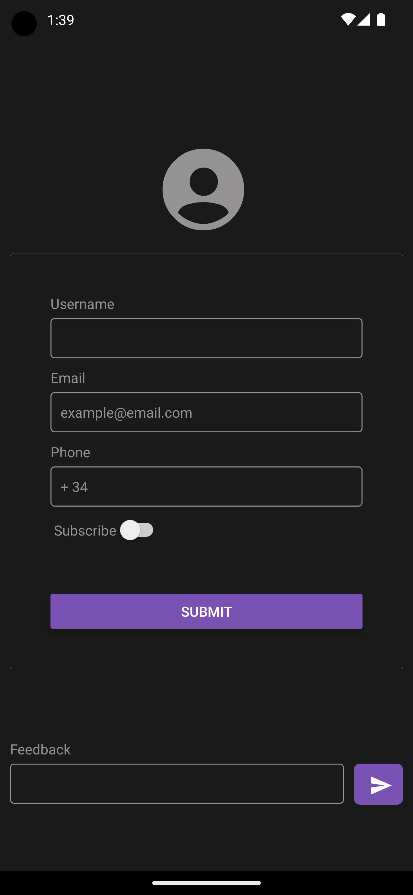

# React Native Components Catalog for IOS and Android
This is a React Native App focused in creating a catalog of the main React Native components out there and how can be used. This way you can easly grab their implementation or use as guide for your projects.

## Configuration
The app is configured for IOs and Android using [React Native Stack Navigation](https://reactnavigation.org/docs/stack-navigator/) and [Vector Icons](https://github.com/oblador/react-native-vector-icons) ([Ionicons](https://ionic.io/ionicons)).

## Run
#### Install Dependencies
```npm i```

#### Start Metro
```npm run start```

## Gallery





